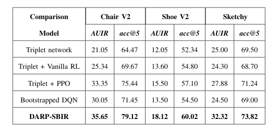

# DARP-SBIR
## Intro
This repository contains the source code implementation for ICDM submission paper [Deep Reinforced Attention Regression for Partial Sketch Based Image Retrieval](https://drive.google.com/file/d/1IRC_8Wuhfs0-oVSY0AkfySOAJoVa3Wrp/view?usp=sharing).
The python files SBIR_*.py are the core framework codes to run this project under different settings, by integrating training code and evaluation code all in one file.

## Dependencies
+ numpy
+ pickle
+ pytorch>=1.5.0
+ torchvision>=0.7.0
+ tqdm
+ tensorboard
+ bresenham
+ Pillow

## Dataset
+ [Sketchy](https://sketchy.eye.gatech.edu)
+ [QMUL-Shoe-V2](http://sketchx.eecs.qmul.ac.uk/downloads/)
+ [QMUL-Chair-V2](http://sketchx.eecs.qmul.ac.uk/downloads/)

## Pre-trained
+ Pre-trained Embeddings
   + [Train.pickle](https://drive.google.com/file/d/1r31g97k3OHfOqUMAKSmELiXQ0wLVCZYZ/view?usp=sharing)
   + [Test.pickle](https://drive.google.com/file/d/1JcjaPC2WyhuxZeaihh5PcGwMCJTPfDs9/view?usp=sharing)
   
+ Pre-trained Models
   + In folder ckpt
   
## Results and Commands

To produce such results, run the corresponding entrance main files.
+ Triplet Network: main_pure.py
+ Triplet + Vanilla RL: main_RL.py
+ Triplet + PPO: main_finetune.py
+ Bootstrapped DQN: main_dqn.py
+ DARP-SBIR: main_boot.py

For the other two datasets, use main_shoev2.py and main_sketchy.py
